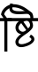

# BanglaText2Image

Convert any bangla text to image. This tool will help to generate synthetic data for bangla OCR training

## Example data sample
| Text        | Image |
| ----------- | ----------- |
|  ঙ্গি    | |
|  ষ্টি    ||
|  দৃষ্টিভঙ্গি কেমন হতে পারে  ||


## Dependency
```sh
sudo apt install default-jre
sudo apt install default-jdk
```

## Project structure
```sh
├── corpus
│   └── bn-data-map.txt # contain the text which need to convert to image
├── data  # unique class based data
│   ├── 0
│   ├── 1
│   ├── 2
│   ├── 3
│   └── 4
├── fonts # bangla fonts
│   └── Siyamrupali.ttf
├── README.md
└── src
    ├── BanglaTextToImage.java
    └── textToImage.java
```

## How to run
```sh
javac BanglaTextToImage.java
java BanglaTextToImage
```

## Configs
Some of the config variable you may need to update based on your need
```java
public static String BN_DATA_MAP_PATH = "../corpus/bn-data-map.txt";
// you can put multiple fonts here
public static String FONTS_DIR = "../fonts";
// shere your images will be saved
public static String DATA_SAVED_DIR = "../data";

// set font size and font color
public static int[] FONT_SIZES = {30, 40, 50};
public static int[] BG_COLOR   = {255, 230, 205};
	
public static int IMAGE_NAME_COUNTER = 1;
public static int NUMBER_OF_CLASS = 11; // number of class you have
// 5 line will be taken from `bn-data-map.txt`
public static int CHUNK_TO_TAKE = 5; // CHUNK_TO_TAKE must be <= chunks.lenght()
```

## Sentence to image
Convert bangla sentece to Image
```sh
javac TextToImage.java
java TextToImage
```
This will output an image like

